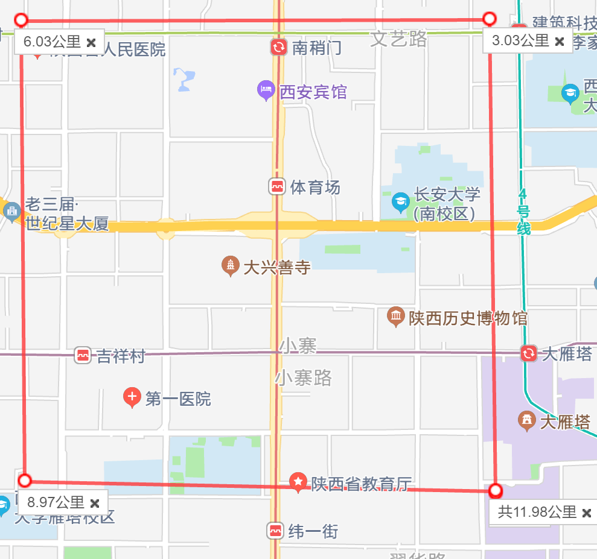

# X
Q1:  
time: 8:00-8:10     unix:1479168000-1479168600  
time: 12:00-12:10   unix:1479182400-1479183000  
time: 17:00-17:10   unix:1479200400-1479201000

3km*3km map coordinate point 

top  left corner (34.241936,108.92909)  top  right corner(34.241936,108.96209)  
down left corner (34.214946,108.92909)  down right corner(34.214946,108.96209)